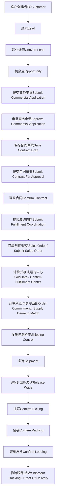
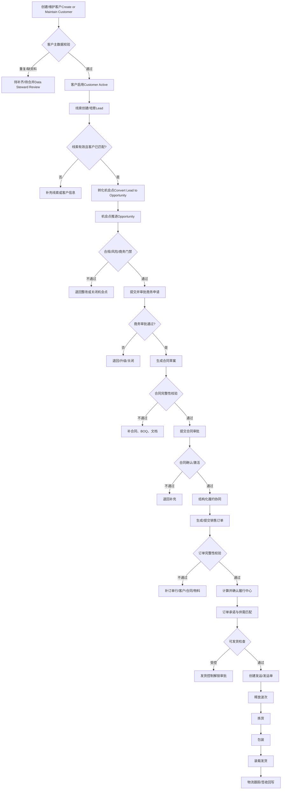

# CRM 客户创建到订单发货流程分析与优化方案

## 1. 文档目的

本文基于当前 ontology mining 候选结果，还原一条从 **CRM 客户创建/维护** 到 **订单提交、履约、出库发货** 的端到端流程，并识别当前流程中的治理问题，最后输出一版优化后的客户创建到订单发货流程。

本流程不是重新设计一个理想流程，而是尽量沿用当前本体候选中已经识别出的业务对象、动作、状态、角色和关系，再对缺口进行治理化补齐。

## 2. 使用到的本体候选结果

| 阶段  | 系统/域 | 关键对象 | 关键动作 |
| --- | --- | --- | --- |
| 客户与销售机会 | CRM xSales | Customer、Customer Contact、Lead、Opportunity | Convert Lead、Nurture Lead |
| 商务与合同 | CRM xSales | Commercial Application、Bill Of Quantity、Contract、Purchase Order、Delivery Plan | Submit Commercial Application、Approve Commercial Application、Save Contract Draft、Submit Contract For Approval、Confirm Contract |
| 履约交接 | CRM xSales | Fulfillment Coordination | Submit Fulfillment Coordination |
| 订单履行 | OTC/OMS | Sales Order、Sales Order Line、Customer Purchase Order、Order Commitment、Supply Demand Match、Fulfillment Center、Shipping Control、Shipment、Shipment Tracking | Submit Sales Order、Calculate Fulfillment Center、Confirm Fulfillment Center、Update Delivery Date、Unlock Shipping Control |
| 仓储发货 | WMS | Shipping Order、Wave、Picking Task、Packing、Load、Shipment、Shipment Line、Proof Of Delivery | Release Wave、Confirm Picking、Confirm Packing、Confirm Loading、Confirm Delivery |

## 3. 当前流程还原

### 3.1 当前流程总览

### 3.2 当前流程步骤

| 步骤  | 当前对象/动作 | 执行角色 | 关键输入 | 当前输出 | 主要证据 |
| --- | --- | --- | --- | --- | --- |
| 1   | Customer 客户创建/维护 | 销售/客户关系人员，当前动作未显式建模 | 客户编码、客户名称、客户状态、客户行业 | CRM 客户对象 | CRM Customer |
| 2   | Lead 线索维护 | 销售人员 | 线索编号、线索名称、线索阶段、有效性 | 可转化线索 | CRM Lead |
| 3   | Convert Lead 转化线索 | 销售人员 | 有效线索、转化原因、目标机会点说明 | Opportunity 机会点 | CRM convertLead |
| 4   | Opportunity 机会点跟进 | 销售/机会点负责人 | 机会点编码、机会点名称、销售阶段、预计金额、客户 | 可进入商务申请或合同准备的机会点 | CRM Opportunity |
| 5   | Submit Commercial Application 提交商务申请 | 销售人员 | 申请说明、期望决策事项、关联机会点 | 商务申请进入审批/决策流程 | CRM submitCommercialApplication |
| 6   | Approve Commercial Application 审批商务申请 | 商务审批人 | 审批结论、审批意见 | 商务申请决策结果，影响机会点、合同或 BOQ | CRM approveCommercialApplication |
| 7   | Save Contract Draft 保存合同草案 | 合同商务或销售人员 | 客户、机会点、签约主体、合同基础信息 | 合同草案 | CRM saveContractDraft |
| 8   | Submit Contract For Approval 提交合同审批 | 合同商务或销售人员 | 合同基础信息、报价清单、必要文档、期望审批路径 | 合同进入审批中 | CRM submitContractForApproval |
| 9   | Confirm Contract 确认合同 | 合同评审决策组织人 | 确认结论、确认意见、待确认合同 | 合同可进入激活、归档或履约协同 | CRM confirmContract |
| 10  | Submit Fulfillment Coordination 提交履约协同 | 合同商务或履约协同人员 | 协同范围、合同/订单、金额、地址、交付范围 | 下游履约、财务或交付团队获得处理责任 | CRM submitFulfillmentCoordination |
| 11  | Sales Order 创建/提交订单 | 订单录入人员 | 订单号、订单状态、订单类型、客户、合同号、订单行 | 订单状态变为已提交，触发履行处理 | OTC SalesOrder / submitSalesOrder |
| 12  | Calculate / Confirm Fulfillment Center 计算并确认履行中心 | 供应业务人员、履行中心确认人员 | 签约公司、国家、合同类型、物料、产品、客户、订单行 | 履行中心确认完成 | OTC calculateFulfillmentCenter / confirmFulfillmentCenter |
| 13  | Order Commitment / Supply Demand Match 订单承诺与供需匹配 | 订单履行人员/供应业务人员 | 订单、订单行、物料、履行中心、需求数量、供应数量 | 承诺交付日期、匹配状态 | OTC OrderCommitment / SupplyDemandMatch |
| 14  | Shipping Control 发货控制 | 订单履行人员 | 发货控制标记、控制原因、解锁状态 | 允许或阻塞发运 | OTC ShippingControl / unlockShippingControl |
| 15  | Shipment 发运 | 物流/履约人员 | 发运单号、订单号、发运数量、子库、货位 | 发运记录 | OTC Shipment |
| 16  | Release Wave 释放波次 | 仓库计划员 | 订单选择、库存分配、作业参数 | 拣货、补货或复核任务 | WMS releaseWave |
| 17  | Confirm Picking 确认拣货 | 拣货员 | 拣货任务、库位、数量、处理结果 | 拣货结果、库存移动结果 | WMS confirmPicking |
| 18  | Confirm Packing 确认包装 | 包装员 | 箱、货品、数量、处理结果 | 包装结果 | WMS confirmPacking |
| 19  | Confirm Loading 确认装载 | 装车员 | 发运货品、车辆、装载结果 | 装载结果、车辆封签、发运状态 | WMS confirmLoading |
| 20  | Confirm Delivery 确认签收 | 司机或收货方 | 签收结果、异常原因、发生时间 | 签收凭证、运单状态更新 | WMS confirmDelivery |

## 4. 当前流程问题识别

### 4.1 客户创建动作缺失，客户主数据门禁不足

当前 CRM Customer 对象已经识别出 `客户编码 / Customer Code`、`客户名称 / Customer Name`、`客户状态 / Customer Status`、`客户行业 / Customer Industry`，但没有稳定的 `Create Customer / 创建客户` 或 `Maintain Customer / 维护客户` 动作候选。

**问题表现**

- 客户作为销售、合同、投标、关系经营共同引用对象，但创建、去重、审批、启用的动作没有显式进入流程。
- 客户编码、客户名称、客户状态可以支撑识别，但缺少统一社会信用代码、客户集团、客户风险状态等跨系统校验字段。
- 后续 Opportunity、Contract、Sales Order 都引用客户，但没有明确客户主数据是否已审核、是否有效、是否可交易。

**影响**

- 可能出现同一客户在 CRM、授信、OTC 中重复创建。
- 销售机会、合同和订单可能绑定到不同客户编码。
- 客户被停用或未审核时，仍可能进入合同或发货流程。

### 4.2 线索、客户、机会点之间的转换门禁不够清晰

Lead 可以由销售人员执行 `Convert Lead` 转化为 Opportunity。前置条件是“线索有效且具备销售机会条件”，但客户是否已创建、客户是否已去重、客户联系人是否完整，没有形成明确门禁。

**问题表现**

- Lead 可能只带客户名称或潜在客户信息。
- 转 Opportunity 时没有强制客户主数据匹配。
- Opportunity 已经可以关联 Customer，但是否必须关联经过审核的 Customer 未明确。

**影响**

- 机会点可能以临时客户名称推进。
- 后续合同草案才发现客户主数据不完整，导致退回或补录。

### 4.3 商务申请与销售评审边界不清

`Submit Commercial Application` 和 `Approve Commercial Application` 已建模，但开放问题仍提示“商务申请与销售评审关系”需要确认。

**问题表现**

- 商务申请审批结果会影响机会点、合同或报价清单，但哪些结论允许进入合同准备，没有强制规则。
- 商务申请、销售评审、投标评审、BOQ 评审之间的先后关系不够明确。

**影响**

- 合同准备可能早于商务审批结论。
- 报价清单、商务审批、合同条款之间可能存在版本不一致。

### 4.4 合同与订单边界未裁决

多个 CRM 动作和对象都引用 OQ-006 “合同与订单边界”。Contract、Purchase Order、Delivery Plan、Fulfillment Coordination 均涉及合同/订单/采购订单/发货安排。

**问题表现**

- 合同生成订单、客户采购订单、销售订单、采购订单之间的对象边界不清。
- CRM 侧的 Purchase Order 与 OTC 侧的 Sales Order/Customer Purchase Order 可能存在语义重叠。
- 合同确认后进入履约协同，但是否自动生成 OTC Sales Order 未明确。

**影响**

- 同一客户订单可能在 CRM 和 OTC 中重复或断裂。
- 合同号、客户采购订单号、销售订单号无法稳定追踪。
- 发货计划和实际发运之间可能无法闭环。

### 4.5 履约协同交接信息不足

Fulfillment Coordination 已识别 `关联合同或采购订单`、`交接范围`、`接收团队`、`履约责任说明`、`金额或地址变更说明`。动作 `Submit Fulfillment Coordination` 会将合同或订单新增、变更、核销、金额或地址信息交接给下游。

**问题表现**

- 接收团队不是必填字段。
- 下游系统对象没有强绑定，例如 OTC Sales Order、Shipment、WMS Shipping Order。
- 协同范围是文本，可能缺少结构化订单行、产品、数量、地址、承诺日期。

**影响**

- 下游履约团队收到的信息不完整。
- 金额、地址、产品、交付范围变更无法稳定触发订单重算。
- 合同变更和发货计划变更容易脱节。

### 4.6 OTC 订单提交与 CRM 合同/客户映射弱

OTC Sales Order 使用订单号作为主识别，关键字段包括订单状态、订单类型、客户、合同号、订单金额。它与 Customer、Contract、Fulfillment Center、Sales Order Line、Shipment 相关。

**问题表现**

- CRM Customer 的 `客户编码` 与 OTC Sales Order 中的 `客户` 是否同一编码体系不明确。
- CRM Contract Number 与 OTC `合同号 / Contract Number` 的映射未显式建模为强关系。
- 订单行的物料、数量、产品编码是否来自合同/BOQ，没有明确一致性校验。

**影响**

- 合同金额与订单金额可能不一致。
- 合同客户与订单客户可能不一致。
- 订单行物料、数量、价格可能与 BOQ 或合同条款不一致。

### 4.7 履行中心、承诺交期和供需匹配规则分散

OTC 侧有 `Calculate Fulfillment Center`、`Confirm Fulfillment Center`、`Order Commitment`、`Supply Demand Match`、`Update Delivery Date` 等对象和动作，但当前流程看起来是分散动作。

**问题表现**

- 履行中心计算依赖签约公司、国家、合同类型、物料、产品、客户条件，但这些字段是否来自合同/订单并未形成统一校验。
- 修改交期要求选择原因分类，但交期变更是否通知客户、是否回写 CRM 发货计划未明确。
- 供需匹配状态是否作为发货放行门禁未明确。

**影响**

- 订单可能在履行中心未确认、供需未匹配时进入发运。
- 交期变更无法同步销售侧客户承诺。

### 4.8 发货控制和仓储发货状态未与订单状态统一

OTC Shipping Control 控制是否允许发货，WMS 侧有 Release Wave、Confirm Picking、Confirm Packing、Confirm Loading、Confirm Delivery 等动作。

**问题表现**

- Shipping Control 解锁后是否自动允许 WMS 波次释放，关系未明确。
- WMS 状态多为候选状态：已创建、处理中、已完成、已取消、异常；和 OTC Sales Order Status、Shipment Status 未统一。
- 拣货、包装、装载、签收异常是否回写 Sales Order、Shipment Tracking 未明确。

**影响**

- 订单发货状态可能散落在 OTC Shipment、WMS Shipping Order、WMS Shipment、Proof Of Delivery 中。
- 销售侧无法实时看到发货状态。

## 5. 优化版流程设计

### 5.1 优化原则

1. **客户先治理，再进入销售机会**：客户创建必须经过身份校验、去重和状态确认。
2. **机会点、商务申请、合同、订单保持一条主链路**：每个下游对象必须保留上游编号。
3. **合同激活后才能生成或提交销售订单**：合同、客户、价格、物料、交付地址、付款条件完整后再流入 OTC。
4. **订单履约前必须完成履行中心、供需匹配和发货控制检查**。
5. **WMS 出库动作必须回写订单与发运状态**。
6. **异常必须有责任人、原因和回退状态**。

### 5.2 优化后流程总览

### 5.3 优化后详细流程

| 阶段  | 优化步骤 | 责任角色 | 必填输入 | 输出对象/状态 | 关键治理规则 |
| --- | --- | --- | --- | --- | --- |
| 1   | 创建或维护客户 | 销售人员、客户主数据管理员 | 客户名称、客户编码、客户行业、客户状态、客户联系人；企业客户建议补统一社会信用代码 | Customer = 待审核 | 无客户编码时只允许进入待匹配客户池，不允许直接创建合同或订单 |
| 2   | 客户主数据校验 | 客户主数据管理员 | 客户编码、客户名称、统一社会信用代码、客户集团、重复匹配结果 | Customer = 已启用/待补齐/重复待合并 | 社会信用代码相同高置信合并；名称相似但信用代码不同禁止自动合并 |
| 3   | 线索创建和培育 | 销售人员 | 线索编号、线索名称、线索阶段、有效性、客户引用 | Lead = 有效/无效/待补充 | 有效线索必须关联已匹配客户或待匹配客户 |
| 4   | 线索转机会点 | 销售人员 | 转化原因、目标机会点说明、客户引用 | Opportunity = 新建/跟进中 | 只有线索有效且客户已匹配，才允许转化为正式机会点 |
| 5   | 机会点推进 | 机会点负责人 | 机会点编码、客户、销售阶段、预计金额、关闭状态 | Opportunity = 商务评审准备 | 机会点必须关联 Customer；客户状态非启用时不能进入商务申请 |
| 6   | 合规/风险门禁 | 销售、合规、风控 | 客户、机会点、贸易合规结果、客户风险状态 | 门禁结果 = 通过/不通过/需升级 | 高风险客户或贸易合规未通过，不允许进入合同审批 |
| 7   | 提交商务申请 | 销售人员 | 申请说明、期望决策事项、机会点、报价或 BOQ 信息 | Commercial Application = 审批中 | 商务申请必须关联机会点和客户 |
| 8   | 审批商务申请 | 商务审批人 | 审批结论、审批意见 | Commercial Application Decision = 通过/退回/升级 | 只有通过或升级后批准的商务申请才能生成合同草案 |
| 9   | 生成合同草案 | 合同商务或销售人员 | 客户、机会点、签约主体、合同基础信息、BOQ、付款条件、交付条款 | Contract = 草案 | 合同客户必须等于机会点客户；合同金额必须能追溯到 BOQ/报价 |
| 10  | 合同完整性校验 | 合同商务、法务/评审人 | 合同基础信息、报价清单、必要文档、签约主体、交付计划 | Contract = 可提交审批 | 缺 BOQ、缺客户、缺签约主体、缺必要文档时不能提交审批 |
| 11  | 提交合同审批 | 合同商务或销售人员 | 提交说明、期望审批路径 | Contract = 审批中 | 审批路径必须来自受控审批配置，不能只填自由文本 |
| 12  | 确认/激活合同 | 合同评审决策组织人 | 确认结论、确认意见 | Contract = 已确认/已激活/退回 | 只有已确认或已激活合同可以触发履约协同 |
| 13  | 结构化履约协同 | 合同商务或履约协同人员 | 合同号、客户编码、订单范围、金额、地址、产品、交付范围、接收团队 | Fulfillment Coordination = 已提交 | 接收团队、交接范围、关联合同或订单必须结构化，不允许只填说明文本 |
| 14  | 生成/提交销售订单 | 订单录入人员 | 合同号、客户、订单类型、订单行、物料、数量、价格、订单金额 | Sales Order = 已提交 | 订单客户必须等于合同客户；订单金额/行项目必须与合同/BOQ 可追溯 |
| 15  | 订单完整性校验 | 订单录入人员、订单管理员 | 订单号、订单状态、订单类型、客户、合同号、订单行 | Sales Order = 可履行 | 缺客户、缺合同号、缺订单行、缺物料或数量时不能提交履行 |
| 16  | 计算履行中心 | 供应业务人员 | 签约公司、国家、合同类型、物料、产品、客户 | Fulfillment Center Calculation | 规则条件不完整时，不允许自动确认履行中心 |
| 17  | 确认履行中心 | 履行中心确认人员 | 待确认订单行、确认备注 | Sales Order Line = 履行中心已确认 | 订单行未确认履行中心时，不允许进入供需匹配和发货 |
| 18  | 订单承诺与供需匹配 | 订单履行人员 | 订单、订单行、物料、需求数量、供应数量、履行中心 | Order Commitment / Supply Demand Match | 供需匹配不足时进入缺货或交期调整流程 |
| 19  | 修改交期 | 订单履行人员 | 新承诺交付日期、变更原因 | Order Commitment = 已更新 | 交期变更必须记录原因，并通知销售/客户责任人 |
| 20  | 发货控制检查 | 订单履行人员 | 发货控制标记、控制原因、解锁状态 | Shipping Control = 可发货/受控 | 发货受控且未解锁时，不允许创建发运 |
| 21  | 创建发运/发运单 | 物流或履约人员 | 订单号、发运数量、子库、货位、发运计划 | Shipment / Shipping Order = 已创建 | 发运数量不得超过订单可发数量；必须关联订单号 |
| 22  | 释放波次 | 仓库计划员 | 订单选择、库存分配、作业参数 | Wave = 已释放 | 库存未分配或作业参数未确认时不能释放波次 |
| 23  | 确认拣货 | 拣货员 | 拣货任务、库位、数量、处理结果、异常原因 | Picking Task = 已拣货/异常 | 拣货差异必须记录异常原因并触发复核或补货 |
| 24  | 确认包装 | 包装员 | 箱、货品、数量、处理结果、异常原因 | Packing = 已包装/异常 | 包装数量必须与拣货结果一致，不一致进入复核 |
| 25  | 确认装载发货 | 装车员 | 发运货品、车辆、装载结果、异常原因 | Load/Shipping Order = 已装载/在途 | 装载确认后回写 Shipment 状态为可发运或在途 |
| 26  | 物流跟踪和签收 | 司机或收货方 | 运单、运输状态、到货时间、签收结果 | Proof Of Delivery = 已签收/异常 | 签收差异必须回写订单跟踪和客户服务异常 |

## 6. 优化后的关键对象字段标准

### 6.1 客户主数据

| 标准字段 | 来源字段 |
| --- | --- |
| `customer_code` | CRM `客户编码 / Customer Code`、授信 `客户编号 / Customer Number`、质量 `qc_customer_code` |
| `customer_name` | CRM `客户名称 / Customer Name`、质量 `customerName/qc_customer_name`、XIBP `Name` 在 Customer 上下文中 |
| `customer_master_status` | CRM `客户状态 / Customer Status` |
| `customer_industry` | CRM `客户行业 / Customer Industry`、质量 `customerIndustry` |
| `unified_social_credit_code` | 授信 `统一社会信用代码 / Unified Social Credit Code` |

### 6.2 销售到合同主链路

| 标准字段 | 用途  |
| --- | --- |
| `lead_code` | 线索编号 |
| `opportunity_code` | 机会点编号 |
| `commercial_application_no` | 商务申请编号 |
| `contract_no` | 合同号 |
| `boq_no` | 报价清单或配置清单编号 |
| `delivery_plan_no` | 发货计划编号 |

### 6.3 合同到订单履约主链路

| 标准字段 | 用途  |
| --- | --- |
| `fulfillment_coordination_no` | 履约协同编号 |
| `sales_order_no` | OTC 销售订单号 |
| `sales_order_line_no` | 订单行号 |
| `fulfillment_center_id` | 履行中心 |
| `committed_delivery_date` | 承诺交付日期 |
| `shipping_control_status` | 发货控制状态 |
| `shipment_no` | 发运单号或运单号 |
| `shipping_order_no` | WMS 发运单号 |
| `proof_of_delivery_no` | 签收凭证编号 |

## 7. 优化后的状态模型

### 7.1 Customer 状态

| 状态  | 含义  | 可进入下一步 |
| --- | --- | --- |
| `Draft` | 客户草稿 | 否   |
| `Pending Review` | 待主数据审核 | 否   |
| `Active` | 已启用 | 是，可创建机会点/合同/订单 |
| `Duplicate Pending Merge` | 疑似重复待合并 | 否   |
| `Inactive` | 停用  | 否   |

### 7.2 Opportunity 状态

| 状态  | 含义  |
| --- | --- |
| `Created` | 已创建 |
| `Qualified` | 已确认有效机会 |
| `Commercial Review` | 商务评审中 |
| `Contract Preparation` | 合同准备中 |
| `Won` | 赢单  |
| `Lost/Cancelled` | 丢单或取消 |

### 7.3 Contract 状态

| 状态  | 含义  | 后续  |
| --- | --- | --- |
| `Draft` | 草案  | 可补充 |
| `Pending Approval` | 审批中 | 等待审批 |
| `Returned` | 退回  | 补充材料 |
| `Confirmed` | 已确认 | 可激活或协同 |
| `Activated` | 已激活 | 可触发履约协同和订单 |
| `Closed` | 已关闭 | 不再生成新订单 |

### 7.4 Sales Order 状态

| 状态  | 含义  |
| --- | --- |
| `Created` | 已创建 |
| `Submitted` | 已提交 |
| `Fulfillment Center Confirmed` | 履行中心已确认 |
| `Committed` | 已形成承诺交期 |
| `Ready To Ship` | 可发货 |
| `Shipping Controlled` | 发货受控 |
| `Shipped` | 已发货 |
| `Delivered` | 已签收 |
| `Exception` | 异常  |
| `Cancelled` | 已取消 |

### 7.5 WMS 出库状态

| 阶段  | 正常状态 | 异常状态 |
| --- | --- | --- |
| 波次  | `Created -> Released` | `Release Failed -> Pending Adjustment/Exception` |
| 拣货  | `Pending Picking -> Picked` | `Shortage -> Exception/Replenishment Required` |
| 包装  | `Pending Packing -> Packed` | `Packing Variance -> Exception/Pending Review` |
| 装载  | `Pending Loading -> Loaded` | `Loading Variance -> Exception/Pending Review` |
| 签收  | `In Transit -> Delivered` | `Delivery Variance -> Exception/Pending Review` |

## 8. 优化后的系统职责分工

| 系统  | 主责范围 | 不应承担的职责 |
| --- | --- | --- |
| CRM | 客户、联系人、线索、机会点、商务申请、合同、发货计划、履约协同发起 | 不直接管理仓库拣货、包装、装载状态 |
| 授信/风控 | 客户主体校验、统一社会信用代码、准入、额度、风险状态 | 不替代 CRM 客户经营状态 |
| OTC/OMS | 销售订单、订单行、履行中心、订单承诺、供需匹配、发货控制、发运 | 不作为客户主数据唯一来源 |
| WMS | 波次、拣货、包装、装载、发运单、库存执行状态 | 不裁决合同、价格、客户风险 |
| TMS/物流 | 运单、承运商、运输状态、签收凭证 | 不修改订单商业条款 |

## 9. 建议优先落地的治理改造

### 9.1 第一优先级：客户主数据门禁

- 增加 `Create / Maintain Customer` 动作。
- 客户进入 Opportunity、Contract、Sales Order 前必须是 `Active`。
- 建立 CRM 客户编码、授信客户编号、OTC 客户、质量客户字段映射。
- 引入统一社会信用代码作为企业客户去重锚点。

### 9.2 第二优先级：合同到订单的强映射

- 建立 `Contract Generates Sales Order` 关系。
- Sales Order 必须保留 `contract_no`、`customer_code`、`opportunity_code`。
- 订单行必须能追溯到合同/BOQ 的物料、数量、价格。

### 9.3 第三优先级：履约协同结构化

- Fulfillment Coordination 中 `接收团队` 改为必填。
- `交接范围` 从长文本拆成结构化字段：合同号、订单范围、金额、地址、产品、数量、交付日期。
- 合同变更、地址变更、金额变更必须触发下游订单重校验。

### 9.4 第四优先级：发货放行规则

- 只有满足以下条件，订单才能进入发运：
  - 合同已确认或激活。
  - Sales Order 已提交。
  - 订单行履行中心已确认。
  - 供需匹配状态满足发货。
  - 发货控制未锁定或已解锁。
  - WMS 库存已分配。

### 9.5 第五优先级：端到端状态回写

- WMS 拣货、包装、装载、签收状态必须回写 OTC Shipment / Sales Order。
- OTC Shipment Tracking 应同步给 CRM 客户/机会点/合同视图。
- 销售人员应能从 CRM 看到：订单已提交、履行中心已确认、已发货、在途、已签收、异常。

## 10. 优化后的端到端流程清单

| 序号  | 阶段  | 输入  | 动作  | 输出  | 下一步 |
| --- | --- | --- | --- | --- | --- |
| 1   | 客户主数据 | 客户名称、行业、联系人、社会信用代码 | 创建/维护客户 | Customer Draft | 客户审核 |
| 2   | 客户审核 | Customer Draft | 去重、主体校验、状态确认 | Customer Active | 线索/机会 |
| 3   | 线索  | Lead | 培育线索 | Valid Lead | 转机会 |
| 4   | 机会  | Valid Lead + Customer | 转化线索 | Opportunity | 商务门禁 |
| 5   | 商务  | Opportunity | 提交商务申请 | Commercial Application Pending | 商务审批 |
| 6   | 商务审批 | Commercial Application | 审批商务申请 | Approved Decision | 合同草案 |
| 7   | 合同  | Approved Decision + BOQ | 保存合同草案 | Contract Draft | 合同审批 |
| 8   | 合同审批 | Contract Draft | 提交合同审批 | Contract Pending Approval | 合同确认 |
| 9   | 合同确认 | Contract Pending Approval | 确认合同 | Contract Confirmed / Activated | 履约协同 |
| 10  | 履约协同 | Contract + Delivery Scope | 提交履约协同 | Fulfillment Coordination Submitted | 订单创建 |
| 11  | 订单  | Contract + Customer + Lines | 创建/提交销售订单 | Sales Order Submitted | 履行中心 |
| 12  | 履行中心 | Sales Order Lines | 计算并确认履行中心 | FC Confirmed | 承诺交期 |
| 13  | 承诺交期 | FC + Supply + Demand | 供需匹配/承诺计算 | Committed Delivery Date | 发货控制 |
| 14  | 发货控制 | Sales Order + Control Status | 检查/解锁发货控制 | Ready To Ship | 发运  |
| 15  | 发运  | Ready To Ship Order | 创建发运/发运单 | Shipment / Shipping Order | 波次  |
| 16  | 出库  | Shipment + Inventory | 释放波次 | Wave Released | 拣货  |
| 17  | 拣货  | Picking Task | 确认拣货 | Picked | 包装  |
| 18  | 包装  | Packing Task | 确认包装 | Packed | 装载  |
| 19  | 发货  | Load | 确认装载 | Shipped / In Transit | 物流跟踪 |
| 20  | 签收  | Shipment / POD | 确认签收 | Delivered / Exception | 客户服务/结算 |

## 11. 关键结论

当前本体结果已经足够支撑一条端到端流程，但它暴露出的事实是：**现有流程不是缺少对象，而是缺少跨对象、跨系统的门禁和状态联动**。

最关键的优化点有五个：

1. 客户创建必须从隐含动作变成显式治理动作。
2. 客户、机会点、商务申请、合同、订单必须用统一编号链路串起来。
3. 合同与订单边界必须裁决，避免 CRM Purchase Order、OTC Sales Order、Customer Purchase Order 多套订单语义混用。
4. 履约协同必须结构化，不能只靠文本说明交接。
5. OTC/WMS 发货状态必须回写 CRM，让销售侧能看到真实发货和签收进度。

## 12. 主要来源文件

- `D:\ontology git projects\ontology-mining-crm-xsales-v0\ontology-candidates\object-types\Customer.md`
- `D:\ontology git projects\ontology-mining-crm-xsales-v0\ontology-candidates\object-types\Lead.md`
- `D:\ontology git projects\ontology-mining-crm-xsales-v0\ontology-candidates\object-types\Opportunity.md`
- `D:\ontology git projects\ontology-mining-crm-xsales-v0\ontology-candidates\object-types\Contract.md`
- `D:\ontology git projects\ontology-mining-crm-xsales-v0\ontology-candidates\object-types\DeliveryPlan.md`
- `D:\ontology git projects\ontology-mining-crm-xsales-v0\ontology-candidates\object-types\FulfillmentSystemCoordination.md`
- `D:\ontology git projects\ontology-mining-crm-xsales-v0\ontology-candidates\action-types\convertLead.md`
- `D:\ontology git projects\ontology-mining-crm-xsales-v0\ontology-candidates\action-types\submitCommercialApplication.md`
- `D:\ontology git projects\ontology-mining-crm-xsales-v0\ontology-candidates\action-types\approveCommercialApplication.md`
- `D:\ontology git projects\ontology-mining-crm-xsales-v0\ontology-candidates\action-types\saveContractDraft.md`
- `D:\ontology git projects\ontology-mining-crm-xsales-v0\ontology-candidates\action-types\submitContractForApproval.md`
- `D:\ontology git projects\ontology-mining-crm-xsales-v0\ontology-candidates\action-types\confirmContract.md`
- `D:\ontology git projects\ontology-mining-crm-xsales-v0\ontology-candidates\action-types\submitFulfillmentCoordination.md`
- `D:\ontology git projects\ontology-mining-supply-manufacturing-otc-v0\ontology-candidates\object-types\SalesOrder.md`
- `D:\ontology git projects\ontology-mining-supply-manufacturing-otc-v0\ontology-candidates\object-types\SalesOrderLine.md`
- `D:\ontology git projects\ontology-mining-supply-manufacturing-otc-v0\ontology-candidates\object-types\CustomerPurchaseOrder.md`
- `D:\ontology git projects\ontology-mining-supply-manufacturing-otc-v0\ontology-candidates\object-types\OrderCommitment.md`
- `D:\ontology git projects\ontology-mining-supply-manufacturing-otc-v0\ontology-candidates\object-types\SupplyDemandMatch.md`
- `D:\ontology git projects\ontology-mining-supply-manufacturing-otc-v0\ontology-candidates\object-types\ShippingControl.md`
- `D:\ontology git projects\ontology-mining-supply-manufacturing-otc-v0\ontology-candidates\object-types\Shipment.md`
- `D:\ontology git projects\ontology-mining-supply-manufacturing-otc-v0\ontology-candidates\object-types\ShipmentTracking.md`
- `D:\ontology git projects\ontology-mining-supply-manufacturing-otc-v0\ontology-candidates\action-types\submitSalesOrder.md`
- `D:\ontology git projects\ontology-mining-supply-manufacturing-otc-v0\ontology-candidates\action-types\calculateFulfillmentCenter.md`
- `D:\ontology git projects\ontology-mining-supply-manufacturing-otc-v0\ontology-candidates\action-types\confirmFulfillmentCenter.md`
- `D:\ontology git projects\ontology-mining-supply-manufacturing-otc-v0\ontology-candidates\action-types\updateDeliveryDate.md`
- `D:\ontology git projects\ontology-mining-supply-manufacturing-otc-v0\ontology-candidates\action-types\unlockShippingControl.md`
- `D:\ontology git projects\ontology-mining-supply-manufacturing-wms-no-source-v0\ontology-candidates\object-types\ShippingOrder.md`
- `D:\ontology git projects\ontology-mining-supply-manufacturing-wms-no-source-v0\ontology-candidates\object-types\PickingTask.md`
- `D:\ontology git projects\ontology-mining-supply-manufacturing-wms-no-source-v0\ontology-candidates\object-types\Packing.md`
- `D:\ontology git projects\ontology-mining-supply-manufacturing-wms-no-source-v0\ontology-candidates\object-types\Load.md`
- `D:\ontology git projects\ontology-mining-supply-manufacturing-wms-no-source-v0\ontology-candidates\object-types\ProofOfDelivery.md`
- `D:\ontology git projects\ontology-mining-supply-manufacturing-wms-no-source-v0\ontology-candidates\action-types\releaseWave.md`
- `D:\ontology git projects\ontology-mining-supply-manufacturing-wms-no-source-v0\ontology-candidates\action-types\confirmPicking.md`
- `D:\ontology git projects\ontology-mining-supply-manufacturing-wms-no-source-v0\ontology-candidates\action-types\confirmPacking.md`
- `D:\ontology git projects\ontology-mining-supply-manufacturing-wms-no-source-v0\ontology-candidates\action-types\confirmLoading.md`
- `D:\ontology git projects\ontology-mining-supply-manufacturing-wms-no-source-v0\ontology-candidates\action-types\confirmDelivery.md`
