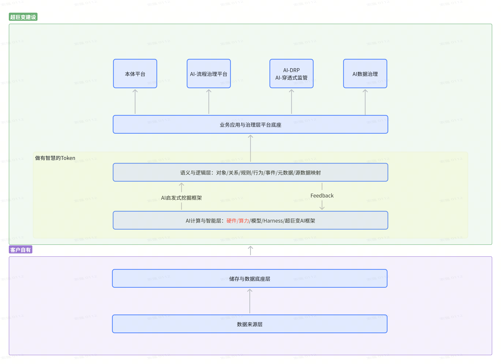

# 超巨变建设架构图说明

## 1. 图片概览

该图片是一张“超巨变建设”分层架构示意图，整体展示了从客户自有数据到 AI 计算与智能层、语义与逻辑层、业务应用与治理平台底座，再到上层应用平台的能力传导关系。

图中可以分为两个主要区域：

- **客户自有区域**：位于底部，表示客户自身掌握的数据来源、存储和数据库底层。
- **超巨变建设区域**：位于上部，表示围绕客户数据构建的 AI 能力、语义逻辑、业务治理和应用平台。

## 2. 架构分层说明

### 2.1 客户自有层

客户自有层位于图片底部的紫色区域，包含两层基础能力：

| 层级 | 图中名称 | 说明 |
| --- | --- | --- |
| 数据来源层 | 数据来源层 | 表示业务系统、原始数据、外部数据或其他客户自有数据入口。 |
| 存储与数据库层 | 存储与数据库底层 | 表示客户侧用于承载数据的数据库、数据仓库、湖仓或存储基础设施。 |

该区域强调数据资产仍归属于客户自身，超巨变建设体系是在客户已有数据基础之上进行能力构建。

### 2.2 AI 计算与智能层

客户自有数据向上进入“超巨变建设”区域后，首先承接的是：

> AI计算与智能层：硬件 / 算力 / 模型 / Harness / 超巨变AI框架

这一层承担 AI 运行和智能计算能力，主要包含：

- **硬件**：承载计算任务的基础设施。
- **算力**：支撑模型训练、推理和数据处理的计算资源。
- **模型**：包括大模型、行业模型、业务模型或其他 AI 模型能力。
- **Harness**：用于模型调用、编排、治理或工程化落地的支撑能力。
- **超巨变 AI 框架**：作为整体 AI 能力的框架化支撑。

### 2.3 做有智慧的 Token

在 AI 计算与智能层之上，图中用浅黄色区域标注了“做有智慧的Token”。该区域包含语义逻辑能力，是整张图的核心中间层。

其中关键模块为：

> 语义与逻辑层：对象 / 关系 / 规则 / 行为 / 事件 / 元数据 / 源数据映射

这一层的作用是把底层数据和 AI 能力转化为可理解、可治理、可复用的业务语义结构，包括：

- **对象**：抽象业务实体，如客户、订单、设备、合同、项目等。
- **关系**：描述对象之间的关联关系。
- **规则**：沉淀业务规则、约束条件和判断逻辑。
- **行为**：表示业务动作或系统操作。
- **事件**：记录业务过程中发生的关键变化。
- **元数据**：用于描述数据结构、字段含义、来源和口径。
- **源数据映射**：将语义对象和底层真实数据建立映射关系。

图中还标注了两个关键机制：

- **AI 启发式挖掘框架**：从 AI 计算与智能层向上支撑语义与逻辑层建设，用于发现、提取和组织业务语义。
- **Feedback**：从语义与逻辑层向下反馈到 AI 计算与智能层，形成持续优化闭环。

### 2.4 业务应用与治理层平台底座

语义与逻辑层继续向上支撑：

> 业务应用与治理层平台底座

该底座是上层业务系统、治理系统和 AI 应用平台的共同基础。它的作用是把语义化、逻辑化后的能力转化为可被不同平台调用和复用的应用底座。

### 2.5 上层应用平台

图片最上方展示了四类基于平台底座构建的上层应用：

| 平台 | 说明 |
| --- | --- |
| 本体平台 | 用于管理业务对象、关系、规则和语义模型，是业务本体建设的承载平台。 |
| AI-流程治理平台 | 面向业务流程的识别、治理、优化和智能化管理。 |
| AI-DRP / AI-穿透式监管 | 面向 DRP 场景及穿透式监管场景，支持更深入的业务监测和治理。 |
| AI数据治理 | 面向数据质量、数据标准、数据资产、数据关系和数据治理闭环。 |

这些平台并不是孤立建设，而是共同依赖“业务应用与治理层平台底座”，并通过底座连接下方的语义与逻辑层、AI 计算与智能层和客户自有数据。

## 3. 图中数据与能力流向

整张图的主流程可以概括为：

1. **客户自有数据来源**进入客户侧的存储与数据库底层。
2. **存储与数据库底层**向上支撑超巨变建设体系。
3. **AI 计算与智能层**基于硬件、算力、模型、Harness 和超巨变 AI 框架提供智能计算能力。
4. **AI 启发式挖掘框架**将底层 AI 能力向上转化为语义与逻辑能力。
5. **语义与逻辑层**对对象、关系、规则、行为、事件、元数据和源数据映射进行统一组织。
6. **Feedback 机制**将语义层运行和治理结果反馈到底层 AI 能力，形成持续迭代。
7. **业务应用与治理层平台底座**承接语义能力，向上支撑多个业务和治理平台。
8. **上层平台**围绕本体建设、流程治理、穿透式监管和数据治理开展具体业务应用。

## 4. 核心含义

该架构图表达的核心思想是：以客户自有数据为基础，通过 AI 计算与智能框架建设语义化、逻辑化的中间层，使 Token 不只是文本片段，而是具备对象、关系、规则、行为、事件和数据映射能力的“智慧 Token”。在此基础上，再统一支撑本体平台、流程治理平台、穿透式监管平台和数据治理平台。

换言之，该图强调的不是单点 AI 应用，而是一套从数据、算力、模型、语义、治理到底层平台化应用的完整建设路径。

## 5. 适用场景

该架构可适用于以下场景：

- 企业业务本体建设
- AI 驱动的数据治理
- 业务流程治理与流程智能化
- 穿透式监管与风险识别
- 数据资产语义化管理
- 企业级 AI 应用底座建设
- 面向大模型的业务知识组织与映射

